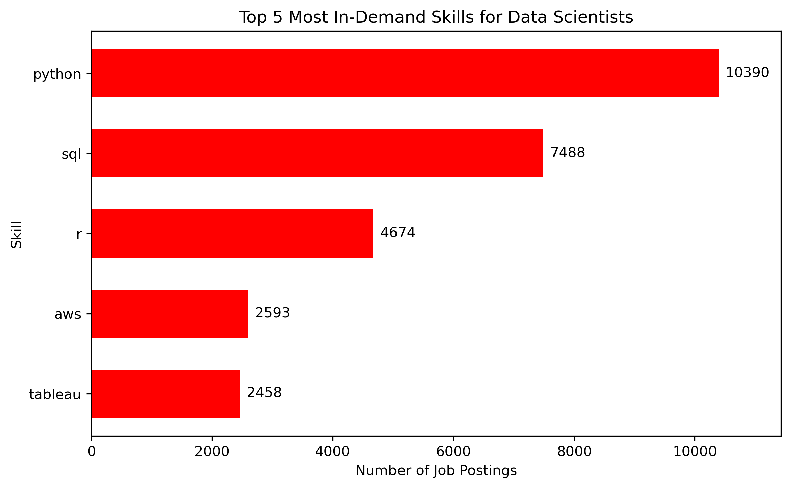
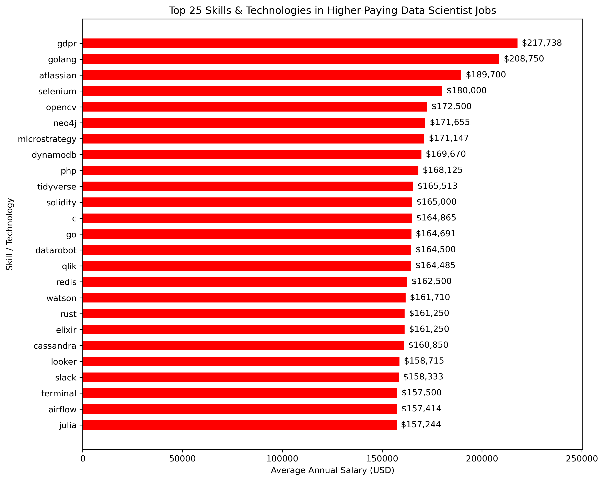
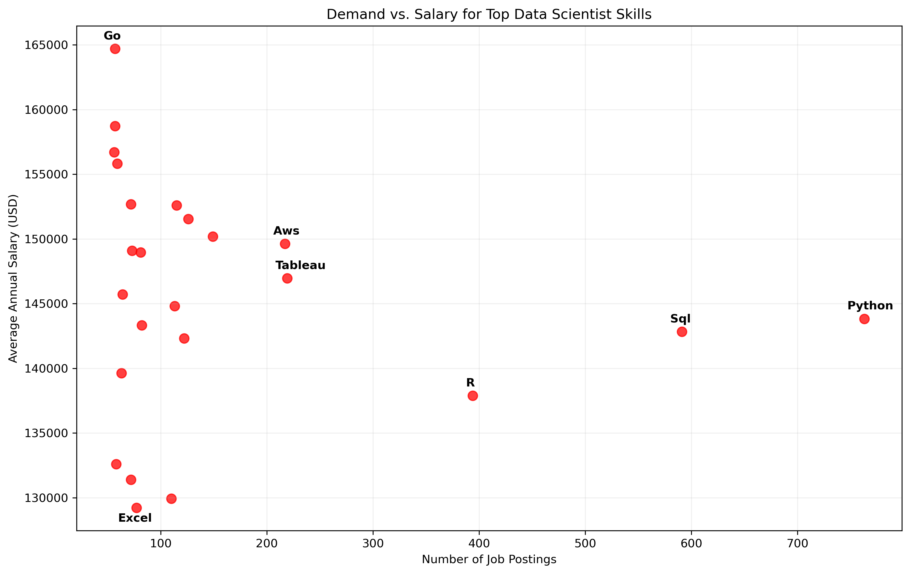

# Introduction

This project uses SQL to analyse the 2023 data science job market, with a focus on salaries, in-demand skills, and the skills associated with higher-paying roles.

The analysis was inspired by Luke Barousse's SQL course and uses his 2023 data job postings dataset. I adapted the analysis to focus specifically on Data Scientist roles.

SQL queries? Check them here: [project_sql folder](/project_sql/)

# Tools I used

- SQL / PostgreSQL – data querying and analysis
- Visual Studio Code – SQL development environment
- Git & GitHub – version control and project sharing
- Python - data visualisation

# The analysis

### 1. Top-Paying Data Scientist Jobs

Identified the 10 highest-paying remote Data Scientist positions with reported annual salaries. This highlights some of the most lucrative opportunities available in the dataset.

```SQL
SELECT
    job_id,
    job_title,
    job_location,
    job_schedule_type,
    salary_year_avg,
    job_posted_date,
    company_dim.name AS company_name
FROM job_postings_fact
LEFT JOIN company_dim ON job_postings_fact.company_id = company_dim.company_id
WHERE
    job_title_short = 'Data Scientist' AND
    job_location = 'Anywhere' AND
    salary_year_avg IS NOT NULL
ORDER BY
    salary_year_avg DESC
LIMIT 10;
```

### 2. Skills Required for Top-Paying Data Scientist Jobs

Examined the skills listed in the highest-paying Data Scientist job postings to identify the technical skills most commonly associated with these roles.

```sql
WITH top_paying_jobs_cte AS (
    SELECT
        job_id,
        job_title,
        salary_year_avg,
        company_dim.name AS company_name
    FROM job_postings_fact
    LEFT JOIN company_dim ON job_postings_fact.company_id = company_dim.company_id
    WHERE
        job_title_short = 'Data Scientist' AND
        job_location = 'Anywhere' AND
        salary_year_avg IS NOT NULL
    ORDER BY
        salary_year_avg DESC
    LIMIT 10
)
SELECT top_paying_jobs_cte.*, skills
FROM top_paying_jobs_cte
INNER JOIN skills_job_dim ON top_paying_jobs_cte.job_id = skills_job_dim.job_id
INNER JOIN skills_dim ON skills_job_dim.skill_id = skills_dim.skill_id
ORDER BY
    salary_year_avg DESC
```

### 3. Most In-Demand Skills

Identified the top 5 most in-demand skills among remote Data Scientist job postings by counting how frequently each skill appeared in the dataset. This provides insight into the skills most frequently requested by employers.



### 4. Skills\Technologies Associated with Higher Salaries

Identified the skills and technologies associated with the highest average salaries among remote Data Scientist job postings with reported salaries. This provides insight into the skills, tools, and technologies that appear in job postings offering higher average compensation.



### 5. Demand vs. Salary for Top Data Scientist Skills

Combined skill demand and average salary to examine the balance between how frequently skills are requested and their associated compensation.



# What I learned

- Python and SQL were the most frequently requested skills among remote Data Scientist postings.
- The most in-demand skills were not necessarily associated with the highest average salaries.
- Skills such as Python, SQL, AWS and Tableau showed different trade-offs between demand and salary.

# Conclusion

This analysis provided an overview of the 2023 Data Scientist job market, focusing on salaries, skill demand, and the relationship between the two. The results showed that Python, SQL, and R were among the most in-demand skills, while some less frequently requested skills were associated with higher average salaries.

Overall, the analysis highlights that high demand does not necessarily correspond to higher salaries, and that different skills can offer different opportunities in the Data Scientist job market.

Note: This analysis is based on 2023 job-posting data and reflects the job market captured in that dataset.
